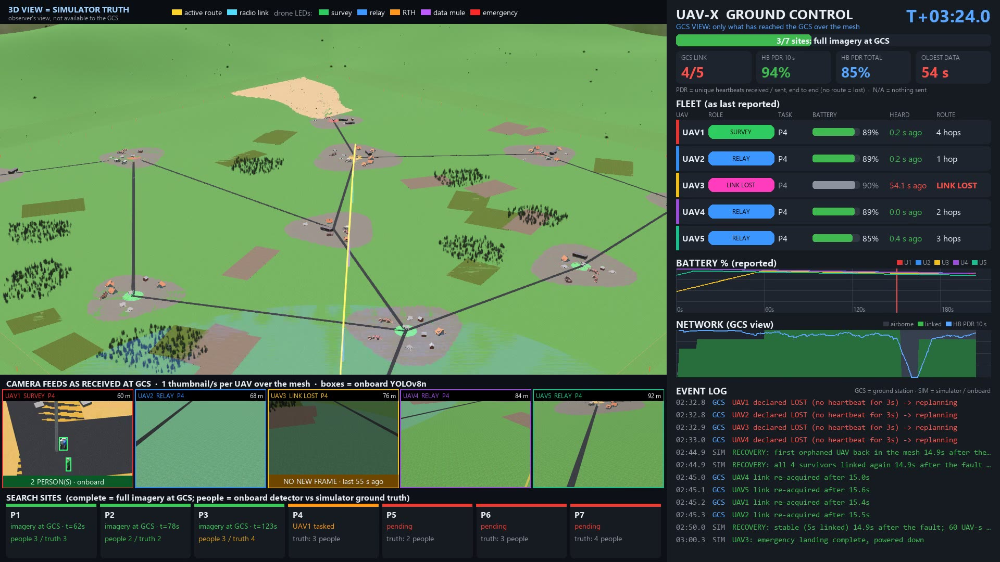
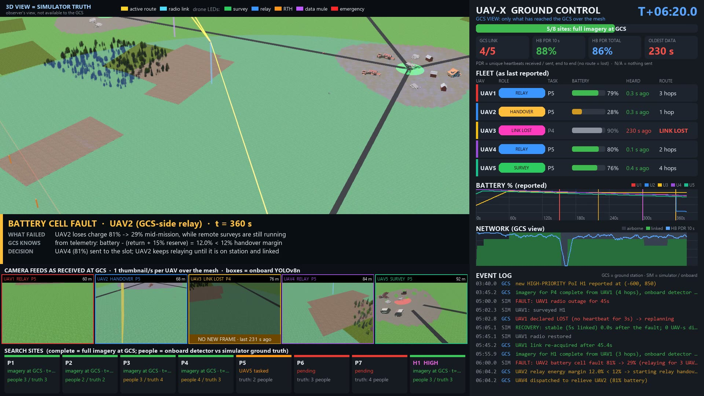

# UAV-X Stage 1 PoC v3.1: Resilient BVLOS Swarm at real BVLOS scale (Webots)

Proof-of-concept simulation for **UAV-X: Resilient BVLOS Swarm Challenge**
(PUSHPAK Grand Challenge 2026, IIT Bombay Techfest).

An earthquake and landslide have hit a rural district and cut ground
communications. From a forward Ground Control Station (GCS), five DJI Mavic
2 Pro UAVs:

- search a **2 km × 2 km** operating area, with villages up to **2.4 km**
  away (far beyond visual line of sight),
- find survivors with an onboard YOLOv8n model,
- send imagery back over a **multi-hop aerial mesh**. Each radio reaches
  600 m, so relaying is the only way the GCS can see anything.

During the run the swarm also handles:

- a critical fault on its busiest relay,
- a radio outage,
- a new high-priority site,
- battery limits,
- a geofence,

all without manual re-tasking.




## v3.1: operator fix brief (25 Sep 2026)

Start with [`docs/OPERATOR_REPORT.md`](docs/OPERATOR_REPORT.md). It gives a
finding-by-finding disposition, evidence, reproduction commands, and the
failures and limitations that remain open.

Video: `media/uav_x_4.mp4` (also `Desktop/uav_x 4.mp4`). Every number on
its result cards is read from files the run wrote; 16/16 key metrics were
recomputed independently from raw logs.

| Document | Contents |
|---|---|
| `docs/METRICS.md` | Every metric: populations, formulas, units, cohort PDR, predeclared internal constraints |
| `docs/OUTAGE_LEDGER.md` | Cause rules, the seed-7 ledger, reconciliation with the recorded "16 episodes / 239 UAV-s" |
| `docs/PERCEPTION.md` | Counting rule, 72-view Webots benchmark, the explained count discrepancies |
| `results/evaluation.md` | Benchmark: 120 saved scenarios × 4 planners × E1/E2/E3, quantiles and worst cases |
| `results/before_after.md` | Recorded v3 code vs v3.1 on the same 60 scenarios |

```bash
python -m unittest discover -s tests -v            # 65 tests (incl. negative isolation tests)
python tools/run_headless.py                       # seed 7 + raw logs
python tools/recompute_metrics.py results scenario # independent recomputation
python tools/evaluate.py                           # full benchmark (~15 min, all cores)
```

**Record the video** (keep the Webots window visible: a minimised window
records a black 3D view on this machine):

```powershell
$env:UAVX_RECORD_MOVIE="$PWD\media\uav_x_4.mp4"
& "$env:LOCALAPPDATA\Programs\Webots\msys64\mingw64\bin\webots.exe" --batch --mode=fast worlds/uavx_stage3.wbt
```

The sections below describe v3 as reviewed after the v2 video. Where
numbers differ from v3.1, the v3.1 documents above take precedence.

## Revised after the technical review of the v2 video

The point-by-point response is in [`docs/REVIEW_RESPONSE.md`](docs/REVIEW_RESPONSE.md).
In short:

- **Information flow is audited.** The GCS acts only on packets that
  crossed the mesh; commands only reach UAVs the same way. Tests prove
  there is no bypass. The dashboard now shows **only GCS knowledge**, with
  data ages.
- **The network model now has latency and capacity.** Imagery is
  1.5 MB/site, sent in chunks with retries. Feeds are thumbnails that can
  be lost.
- **Honest metrics:**
  - first vs **stable** reconnection, re-splits and disconnected
    UAV-seconds;
  - PDR per class, end to end: a packet with no route counts as lost; a
    10 s window reads N/A when nothing was sent;
  - imagery complete and fleet landed are reported separately.
- **Harder scenario:**
  - a **hard fault** (motor + radio) on the busiest relay;
  - an **energy-driven relay handover** after a battery cell fault.
- **Onboard perception** is scored against ground truth.
- **Generalisation:** 30 random scenarios × 3 planners, including a
  fixed-relay baseline, with worst cases reported.
- The evaluation found a real separation bug (a collision in 1 of 30
  runs), which is now fixed and regression-tested.

## What's new in v3 (vs `../webots_2`)

- **Real BVLOS scale.** Visual line of sight for a small multirotor ends
  around 400–500 m. v3 works at operational scale:

  | Parameter | v3 value |
  |---|---|
  | Operating area | 2 km × 2 km |
  | Furthest site from the GCS | ~2.4 km |
  | Air-to-air radio range | 600 m (low-power mesh) |
  | Cruise speed | 15 m/s |
  | Altitude layers | 60–92 m (below the 120 m ceiling) |
  | Endurance | ~30 min (Mavic-class) |
  | Battery swap at the pad | ~2 min |

  The whole world scales with it:
  - 4.8 km of terrain,
  - ten villages linked by roads,
  - farmland and forest,
  - a ridge with the landslide,
  - mountains all around.
- **Realistic failure behaviour: no more falling out of the sky.** A
  critical fault (e.g. a motor or ESC failure) triggers the flight
  controller's **failsafe**:
  - the UAV abandons its task and makes a **level, controlled vertical
    descent** at 2.5 m/s, props turning and nav lights strobing red,
  - it lands and powers down,
  - its radio stays up during the descent, so it **reports EMERGENCY in
    its next heartbeat**.

  The GCS re-plans at once:

  | | Before (timeout-based) | v3 (EMERGENCY heartbeat) |
  |---|---|---|
  | Time for the GCS to learn of the failure | 2.9 s | **0.32 s** |
  | UAVs cut off from the network | 3 | **0** |

  That holds for the **failsafe** case, where the radio survives. After
  the review, the scripted demo uses the harder case, where the fault also
  kills the radio. There the GCS only learns by timeout (2.9 s) and 4
  UAVs are cut off until the mesh re-forms (stable at 14.9 s). The random
  evaluation mixes both cases.

  The failing relay keeps forwarding traffic on its way down while its
  replacement takes over.
- **Drones stay readable at 2 km.** Each UAV has a thin altitude line in
  its own colour. Network tubes and altitude lines are sized by their
  distance from the camera, so they're thin in close-ups and bold in the
  2 km overview.
- **Time-lapse recording.** The ~13.5-minute mission is recorded at 4× with a
  camera director that follows the scenario:
  - launch,
  - chase cam on the busiest relay,
  - its emergency landing,
  - the new site,
  - the radio-outage UAV,
  - surveys,
  - return.

  The recording is composited with the dashboard.
- **Carried over from v2:**
  - Mavic 2 Pro models,
  - gimbal cameras (now 640×480 with zoom),
  - YOLOv8n detection,
  - the GCS dashboard window (fleet status, graphs, feeds that freeze on
    LINK LOST),
  - identical headless and Webots runs.

## Results (scripted scenario, seed 7, `python tools/run_headless.py`)

**Scripted events:**

| Time | Event |
|---|---|
| 150 s | **Hard** fault (motor + radio) on the relay carrying 4 UAVs |
| 220 s | New high-priority site H1, 1.7 km out |
| 300 s | 45 s radio outage on the deepest UAV |
| 360 s | Battery cell fault (−52%) on the GCS-side relay |

| Criterion (weight) | Result |
|---|---|
| Mission Completion (25%) | **8/8 sites**, where complete means the full 1.5 MB imagery bundle is at the GCS. Imagery complete at **664 s**; surviving fleet landed at **808 s**. Survey → GCS latency: mean 24 s, max 69 s (7/8 within 60 s). |
| Communication Resilience (25%) | Connectivity **91.8%**; 239 UAV-s disconnected over 16 partition episodes. Heartbeat PDR end to end **82.1%** (87.7% per routed attempt). Imagery 100% delivered (276 chunks, 417 transmissions). Up to 4 hops. |
| Autonomous Relay & Role Management (20%) | Relay tree re-planned every 1 s; energy-constrained assignment; a backup relay when a UAV is spare. **Energy handover:** replacement on station 21.5 s after the start; outgoing relay released at 28% and landed with **25.9%**. |
| Fault Recovery (15%) | **Hard fault on a 4-dependant relay:** detected by timeout in 2.9 s; 4 orphaned; all relinked and **stable (5 s) at 14.9 s**; 60 UAV-s disconnected; 0 re-splits. **Radio outage:** flagged in 2.8 s, re-acquired 0.12 s after the radio returns. |
| Safety (10%) | Min separation 6.0 m; 0 near misses (< 5 m); 0 collisions; 0 geofence breaches; 0 depletions; min terrain clearance in cruise 59.5 m |
| Innovation (5%) | Fragment contraction, energy-driven handover, backup relays, onboard perception carried with the imagery, audited information flow |

**Generalisation** (`python tools/evaluate.py`, 30 random scenarios per
planner, mean (worst)). Full table: `results/evaluation.md`.

| | adaptive-spare (default) | adaptive-reserve | fixed-relay baseline |
|---|---|---|---|
| Success | 30/30 | 30/30 | 30/30 |
| All imagery delivered (s) | 528 (771) | 697 (1164) | 692 (1713) |
| Connectivity % | 92.1 (82.4) | 87.9 (81.0) | 62.2 (29.9) |
| Stable recovery after the fault (s) | 10.2 (135.7) | 6.4 (101.9) | 105.0 (566.6) |
| UAVs orphaned by the fault | 1.2 (4) | 0.1 (2) | 0.7 (4) |
| Collisions / near misses | 0 / 1 | 0 / 1 | 0 / 9 |

Metric definitions (PDR, stable recovery, connectivity, completion) are
in `docs/ARCHITECTURE.md` §8. They are our definitions, not organiser
rules.

## Requirements

- **Webots R2025a**: <https://cyberbotics.com/#download>
- **Python 3.10+** with `numpy` and `Pillow`.
- `ultralytics` is optional. Without it, everything runs except onboard
  detection: people counts then read "no detector". The weights are in
  `models/yolov8n.pt`.
- An internet connection on the **first** launch, so Webots can download
  and cache its assets.
- `ffmpeg` on `PATH`, only for compositing the demo video.

## Run it

1. Open `worlds/uavx_stage3.wbt` in Webots and press **Play**.
2. The GCS dashboard window opens alongside Webots. It shows only what
   has reached the GCS over the mesh; the 3D view is simulator truth.
3. The mission takes about 13.5 minutes of simulated time. Use Webots'
   fast-forward (⏩) to speed it up.

**Keys** (click the 3D view first):

| Key | Effect |
|---|---|
| `F` | Hard fault on the busiest relay |
| `C` | 15 s radio outage |
| `N` | New high-priority site |
| `B` | Battery cell fault on the GCS-side relay |

**Options:**

| Variable | Effect |
|---|---|
| `UAVX_SCENARIO=0` | No scripted faults |
| `UAVX_DASHBOARD=0` | No dashboard window |
| `UAVX_CINEMATIC=1` | The camera director flies the 3D view |

To keep a backup relay in reserve at all times, set
`BACKUP_POLICY = "reserve"` in `controllers/swarm_supervisor/uavx/config.py`.

## Record the demo video

```powershell
$env:UAVX_RECORD_MOVIE = "$PWD\media\uav_x_3.mp4"   # optional: $env:UAVX_VIDEO_SPEED = "4"
& "$env:LOCALAPPDATA\Programs\Webots\msys64\mingw64\bin\webots.exe" --batch --mode=fast --minimize worlds/uavx_stage3.wbt
```

The output is a 4× time-lapse with an intro card, captions and results
cards. The results cards read `results/evaluation.json`, so run
`tools/evaluate.py` first. The recording takes about 35 minutes of wall
time.

## Run without Webots

```bash
python tools/run_headless.py              # scripted scenario -> results/*_scenario.*
python tools/run_headless.py --no-faults  # no disturbances
python tools/run_headless.py --seeds 20   # packet-loss seed sweep
python tools/evaluate.py                  # 30 random scenarios x 3 planners
python -m unittest discover -s tests -v   # 19 tests incl. information-flow audit
```

Each run writes to `results/`:

- `metrics_*.json`: every metric;
- `timeline_*.csv`: per second, connectivity, PDR (10 s), data age;
- `safety_*.csv`: per second, separation, near misses, terrain clearance;
- `events_*.log`.

## Known limitations

- **Flight:** kinematic, driven by the supervisor; gravity is off. Stage 2
  moves to PX4 SITL or Gazebo.
- **Radio:** distance-threshold model with packet loss that rises with
  distance, per-hop latency and a shared-channel capacity. No terrain or
  building shadowing yet.
- **Battery swap:** time-compressed. The pad charges at 0.8 %/s (about
  2 min).
- **Demo fault times are scripted.** `tools/evaluate.py` randomises them,
  along with targets, fault types and site layouts.
- **Emergency landing:** the UAV lands vertically where it is. Other UAVs
  keep clear of its column.
- **Drone size:** drones are drawn at 10× so they're visible. Distances in
  the radio and flight logic are real.
- **Perception:** YOLOv8n with stock COCO weights, scored against the 24
  survivors placed at 8 sites. It is not tuned for aerial search and
  rescue.
